<!-- _class: title -->

# 社内AI勉強会

第1回 Googleドキュメント・カレンダー・Meetを使いこなす 
2026-09-27（日）岡山大インキュベータ／90分

---

<!-- header: 'はじめに' -->
# 今日持ち帰る3つ

権限を選んで共有

閲覧者・コメント可・編集者の使い分け

Meet付き予定を送る

空き時間を比べて、メールアドレスで招待

変えるのは主催者

定例の曜日や周期は、作った人しか直せない

---

# 今日の流れ

<b>10分</b>はじめに

<b>25分</b>ドキュメント

<b>25分</b>カレンダー

<b>15分</b>Meet

<b>10分</b>予備

<b>5分</b>次回

各ツール2テーマに絞る

明日から使える操作を優先。 時間が余れば3つ目へ

自分の端末で操作する

5人×2グループ。 隣と確認しながら進める

質問はいつでも

気になったところは、その場で。 各ツールの最後に、使っている人の話も聞く

---

<!-- _class: chapter -->
<!-- header: '1. Googleドキュメント' -->

CHAPTER 1

# Googleドキュメント

共有権限、コメントと提案、@メニュー、Gemini

---

# 共有は「誰に」「何をしてもらうか」で権限を選ぶ

<b>閲覧者</b>読むだけ。 配布資料や決定済みの文書

<b>閲覧者（コメント可）</b>確認や意見出しを頼むとき

<b>編集者</b>本文を一緒に書く人だけ

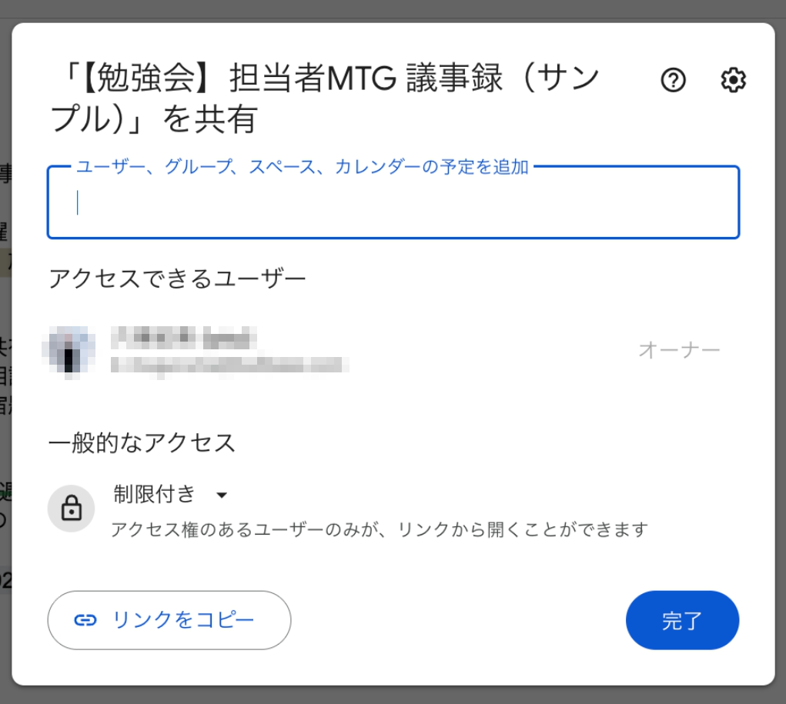

---

# 「リンクを知っている全員」は安易に使わない

<b>基本は「制限付き」</b>業務上必要な相手だけを追加する

<b>社外への共有</b>事前に決めた確認手順に従う

<b>共有前にひと目</b>相手にアクセス権があるか、送る前に確認する

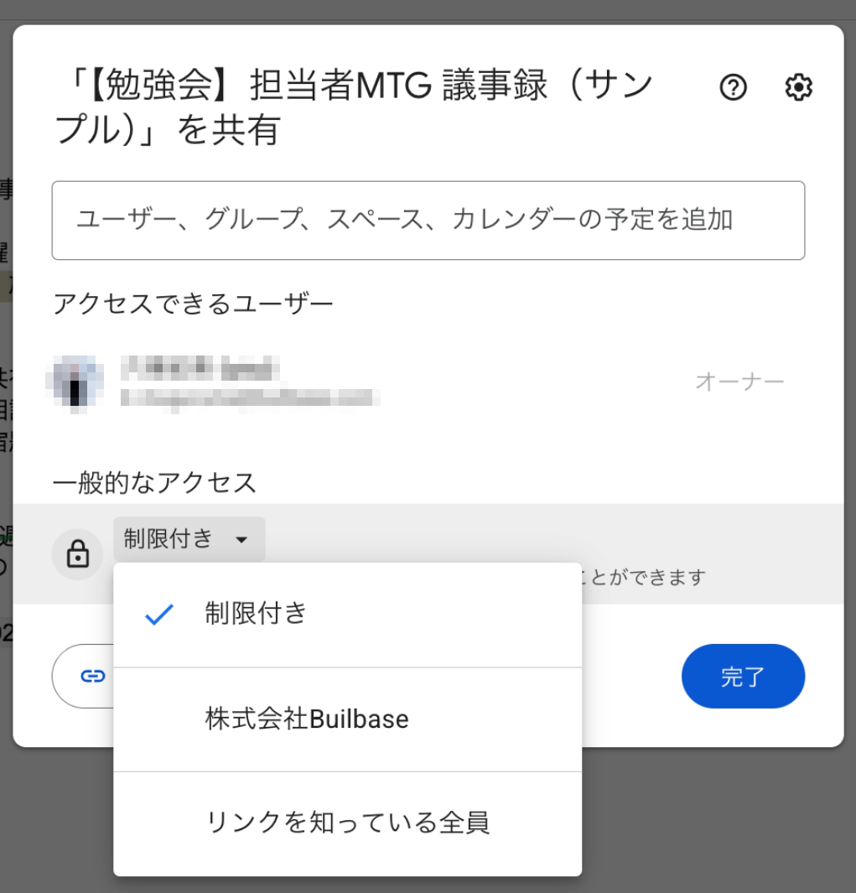

---

# 確認はコメント、修正案は提案モード

コメント

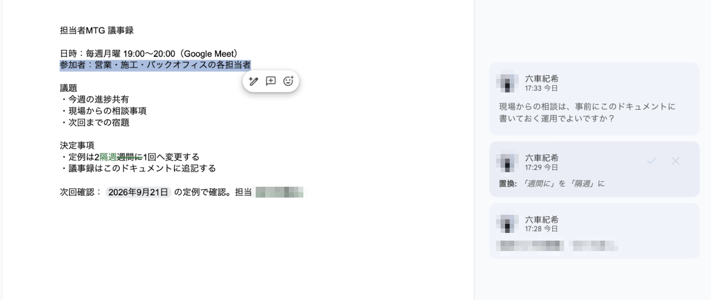

「ここは合っていますか」など確認したいこと。 本文は変わらない

提案モード

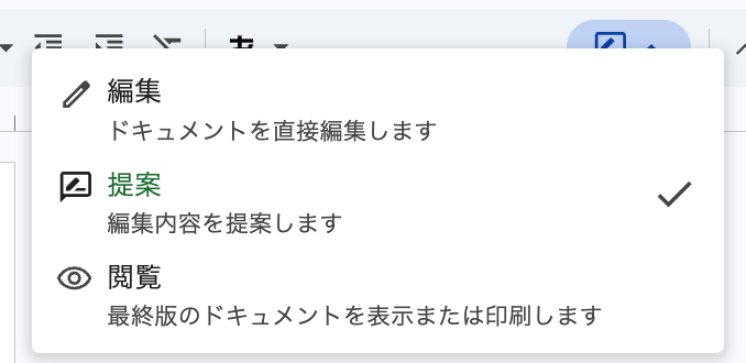

右上の鉛筆から切り替える。 修正案は元の文を消さずに残る

---

# 提案は「承認」で本文になる

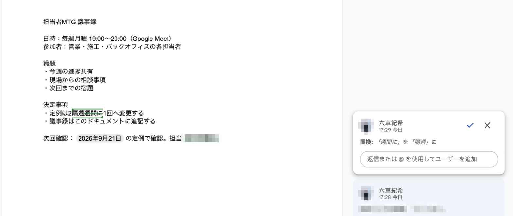

提案された箇所は色つきで残る。 ✓で反映、×で取り下げ。 誰が何を直したかが追える

---

# @を打つと、人・日付・ファイルを埋め込める

@を打つ

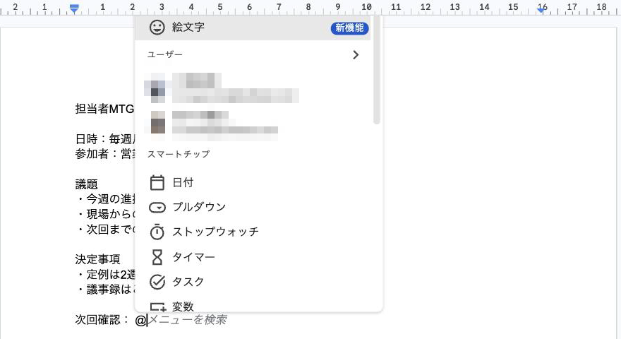

ユーザー、日付、ファイルなどが一覧で出る

入れた結果

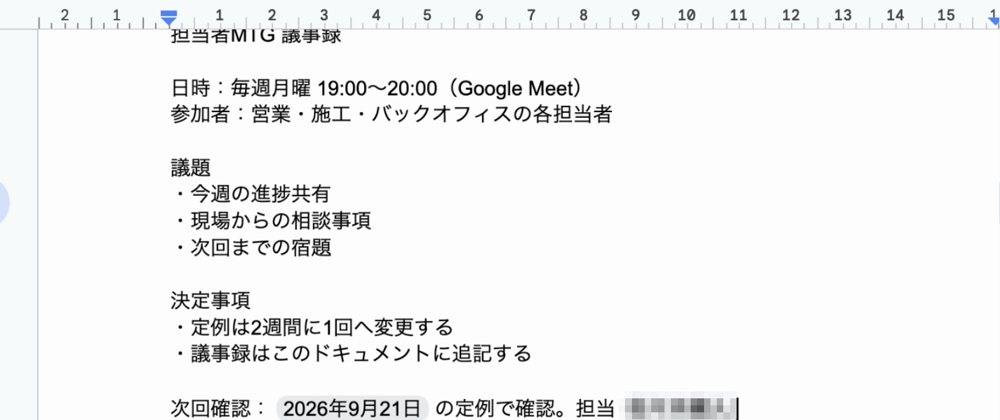

日付と担当者がチップになる。 載せると詳細が出て、表記もそろう

---

# 要約と下書きはGeminiに頼める

<b>長い文書の要約</b>会議前に「要点を3つに」で把握する

<b>下書きと書き換え</b>箇条書きから案内文を作る、丁寧語に直す

<b>そのまま確定にしない</b>生成された文は、人が読んでから使う

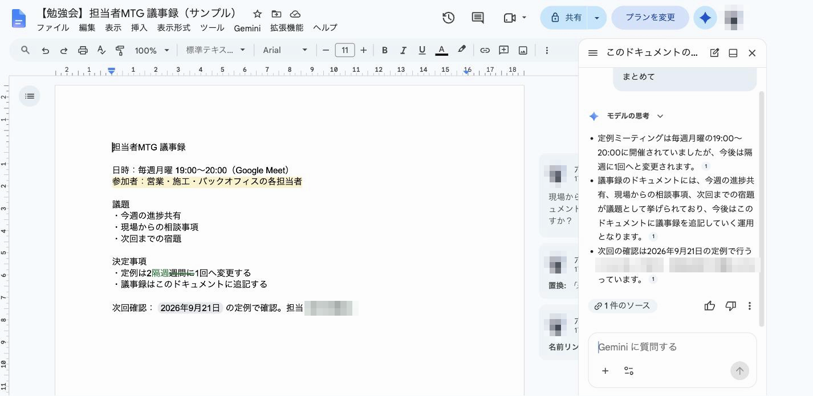

---

# 演習1・ドキュメント（10分）

<i></i>
研修用のサンプル文書を開く<small>講師が共有する。 まず自分の権限が「編集者」か確かめる</small>

<i></i>
気になる1文にコメントを付ける<small>隣の人を@で呼ぶ</small>

<i></i>
提案モードに切り替えて、1語だけ直す<small>元の文が消えないことを見る</small>

<i></i>
隣の人の提案を承認する<small>✓を押した側が「反映した人」になる</small>

<i></i>
@で今日の日付チップを入れる

演習のあとに2分: 普段から使っている人に、実務での使い方をひとこと聞く

---

<!-- _class: chapter -->
<!-- header: '2. Googleカレンダー' -->

CHAPTER 2

# Googleカレンダー

予定を作って招待する、変更する、主催者の役割

---

# 「時間を探す」で、参加者の空きを一度に見る

<b>ゲストを入れてから開く</b>予定の作成画面の「時間を探す」タブ

<b>週表示で並べる</b>全員の予定が横に並ぶ。 空いている帯を選ぶ

<b>往復のメールが減る</b>候補日を聞いて回らなくてよい

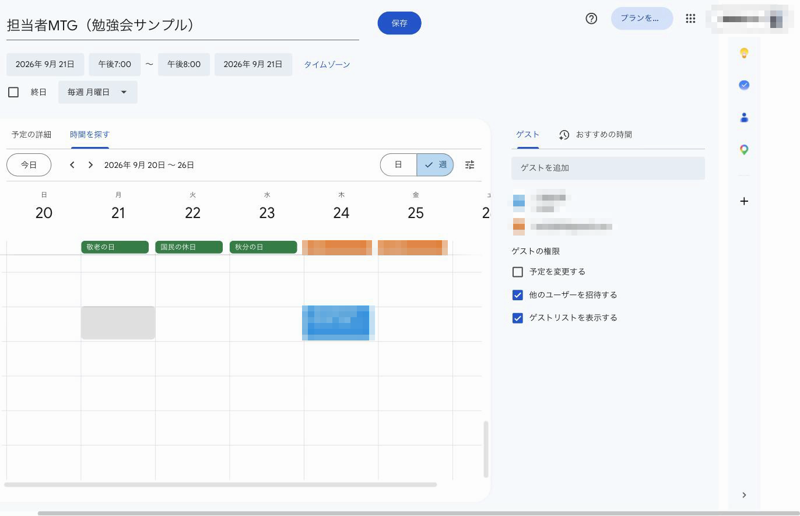

---

# Meet付きの予定を作り、メールアドレスで招待する

<b>タイトルと時間</b>「担当者MTG」のように、後で探せる名前にする

<b>ゲストを追加</b>メールアドレスを入れてEnter。 社外や別ドメインも同じ

<b>Google Meetを追加</b>ボタン1つで会議リンクが付く。 保存時に招待メールが届く

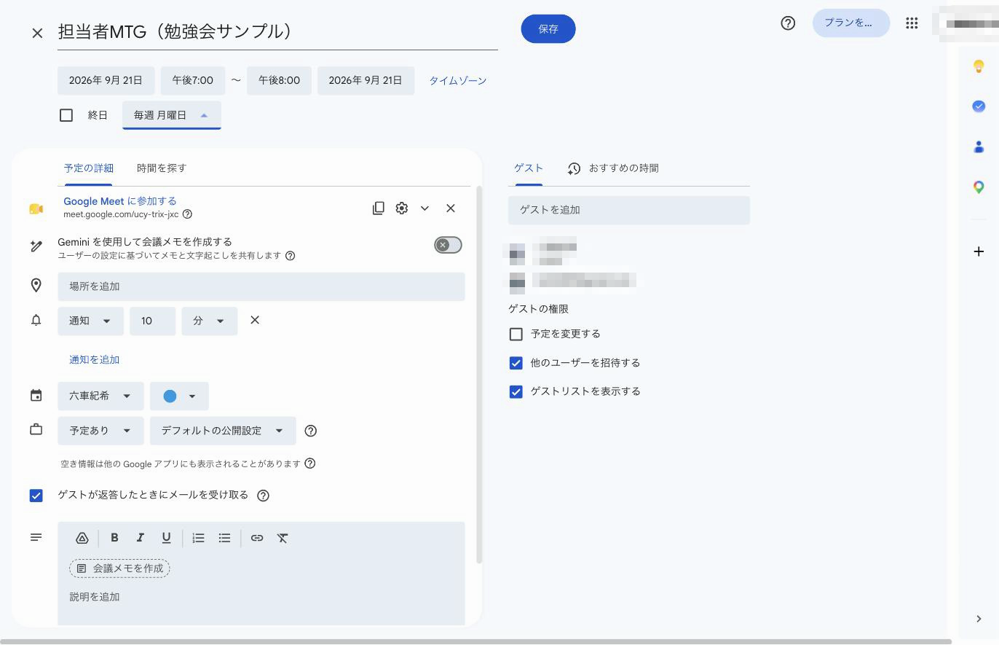

---

# 保存すると招待メールが届く。社外の人は確認が出る

保存したとき

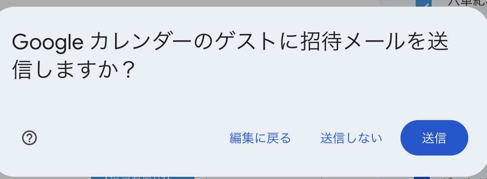

「送信」でゲスト全員に招待メールが届く。 返答もメールで戻る

社外のアドレスを入れたとき

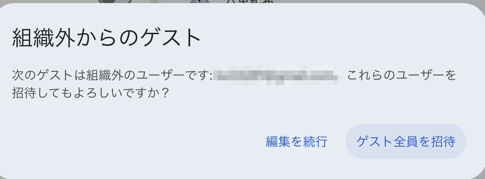

Builbase以外のアドレスは、この確認が出る。 相手を見てから招待する

---

# 定例は「繰り返し」で作る。周期はカスタムで変えられる

繰り返しの選択

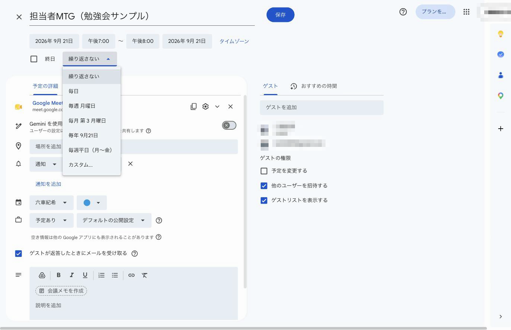

毎週・毎月・平日など。 決まった曜日の会議はここ

カスタム

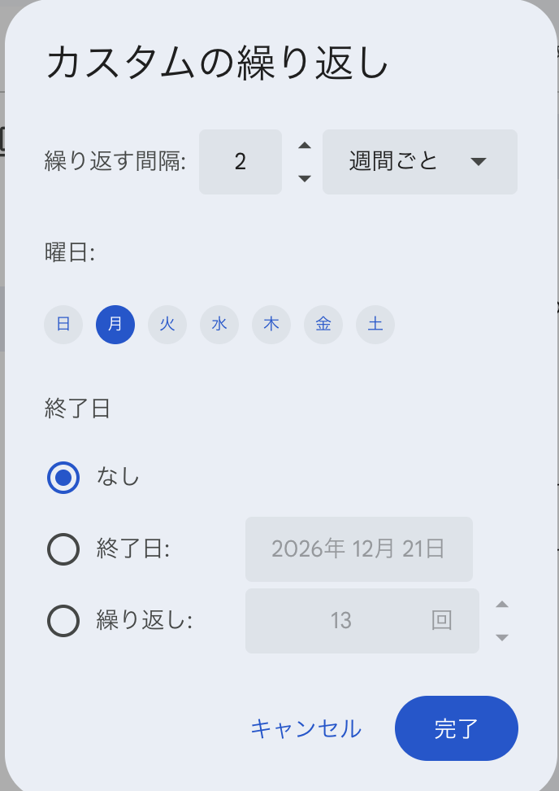

「2週間ごと」「終了日あり」はカスタムで指定する

---

# 招待された側は、出欠と「新しい時間を提案」ができる

<b>はい・いいえ・未定</b>主催者に返答が届く。 放置しないのが最初のルール

<b>新しい時間を提案</b>出られないときは、別の日時を予定から送る

<b>主催者が承認すると更新</b>全員の予定がその日時に書き換わる

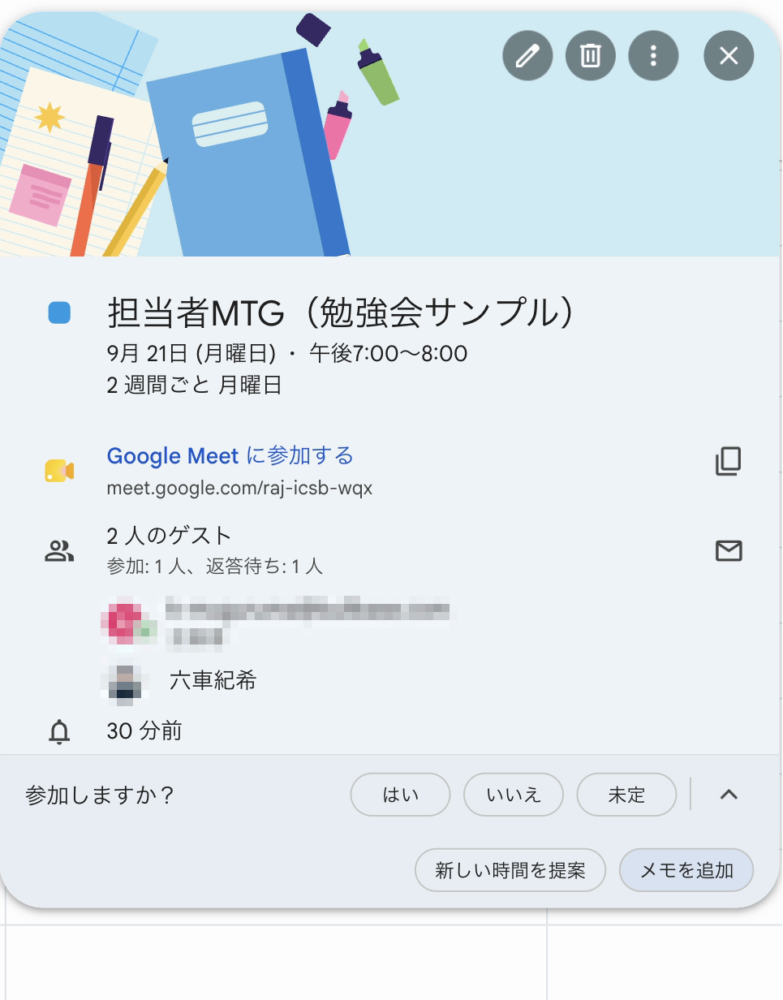

---

# 提案画面では、相手の予定を見ながら候補を選べる

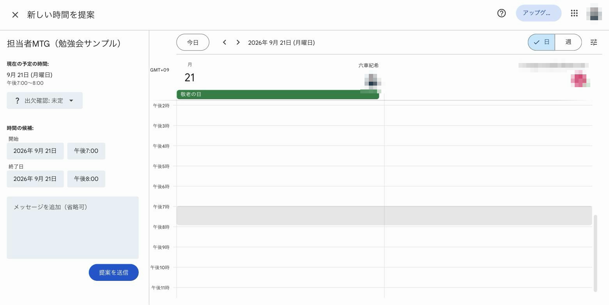

左で日時とひとことを入れ、右で参加者の予定を確かめる。 「提案を送信」で主催者へ届く

---

# 曜日・周期・時刻を変えられるのは、主催者だけ

主催者（作った人）

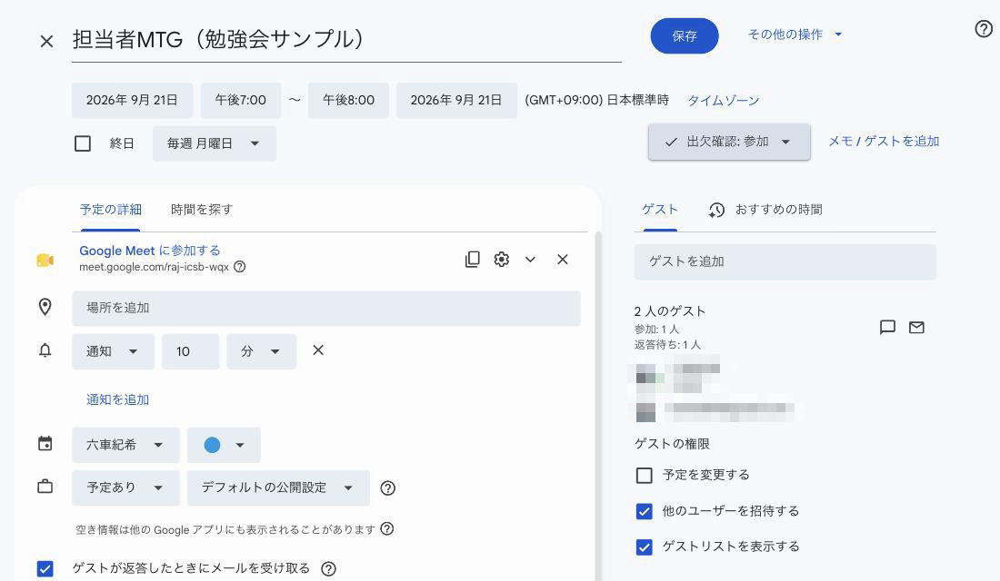

日時も繰り返しもドロップダウンで変えられる

ゲスト（招待された人）

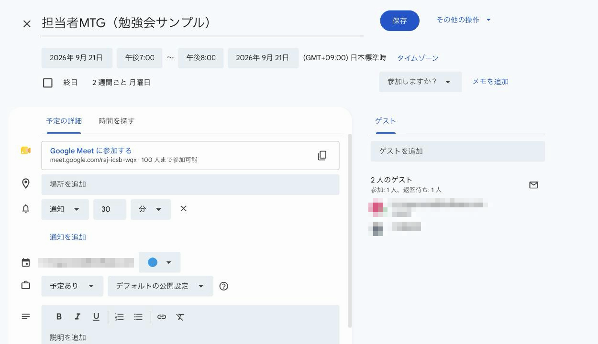

日時と「2週間ごと 月曜日」が文字のまま。 変えられるのは自分の通知や色だけ

---

# 定例を「毎週」から「2週間に1回」にしたいとき

<b>ゲストからは変えられない</b>周期の変更は主催者だけの操作

<b>主催者に頼む</b>「新しい時間を提案」かSlackで依頼する

<b>主催者が保存すると全員に通知</b>変更内容がメールで届く

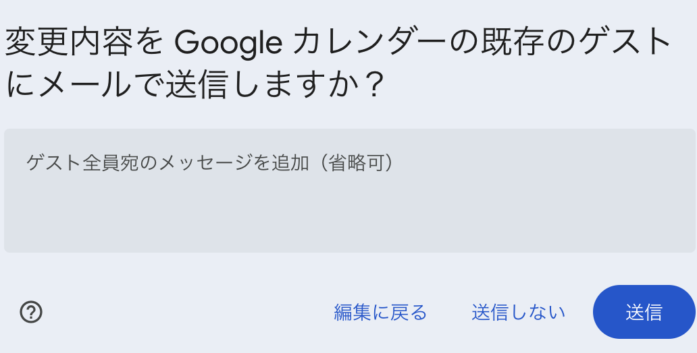

---

# 主催者が変わるときは「主催者を変更」で引き継ぐ

主催者を変更

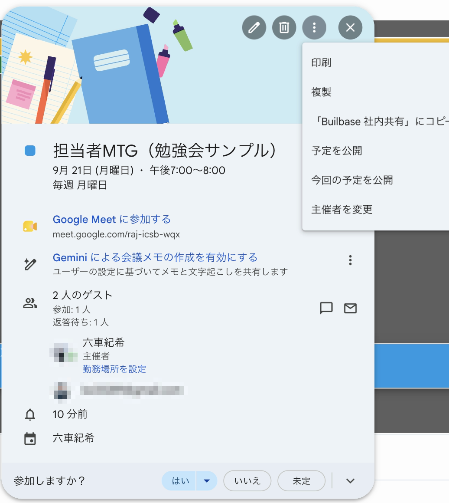

異動や退職の前に。 放置すると誰も直せない定例が残る

ゲストの権限

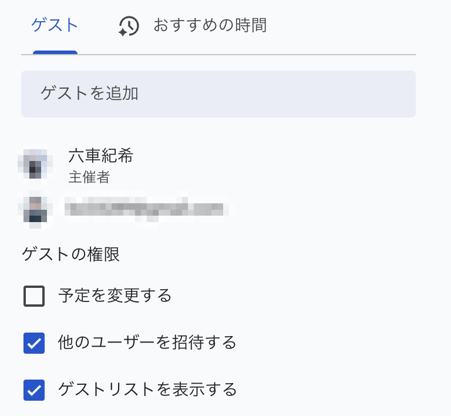

「予定を変更する」を付ければゲストも編集できる。 既定はオフ

---

# 演習2・カレンダー（12分）

<i></i>
グループで主催者役を1人決める

<i></i>
主催者が「時間を探す」で全員の空きを見て、Meet付きの予定を作る<small>グループ全員をメールアドレスで招待。 繰り返しは「毎週」</small>

<i></i>
招待された人は出欠を返す。1人が「新しい時間を提案」する

<i></i>
主催者が提案を承認する。全員の予定が変わったか見る

<i></i>
ゲストが繰り返しを「2週間ごと」に変えようとしてみる<small>変えられないことを確かめてから、主催者が変える</small>

演習のあとに2分: 普段から使っている人に、実務での使い方をひとこと聞く

---

<!-- _class: chapter -->
<!-- header: '3. Google Meet' -->

CHAPTER 3

# Google Meet

会議の機能と保存先、画面共有の使い分け

---

# 録画・文字起こし・字幕は、右下の「会議ツール」から

<b>録画</b>会議ツール→録画。 保存先はドライブの「Meet Recordings」。 押せないときは管理者設定で有効にする

<b>字幕</b>下のバーの「CC」。 自分の画面だけに出る

<b>Geminiの会議メモ</b>カレンダーの予定で「Geminiを使用して会議メモを作成する」をオン。 要約は人が確認する

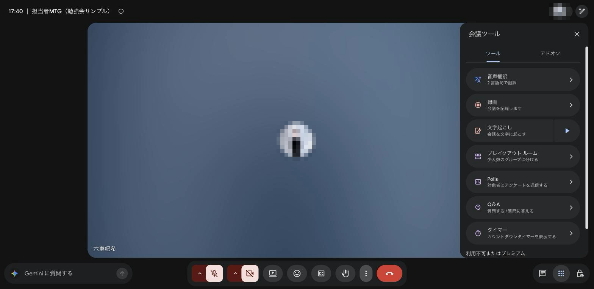

---

# 画面共有は「タブ」「ウィンドウ」「画面全体」を使い分ける

Chromeタブ

<i class="cur"></i><i></i><i></i>

<i class="h"></i><i></i><i class="s"></i><i></i>

<i></i><i></i><i></i>

<b>資料を1つ見せる</b>ときに。 そのタブだけが映る。音声も送れる

ウィンドウ

<i class="cur"></i><i></i><i></i>

<i class="h"></i><i></i><i class="s"></i><i></i>

<i></i><i></i><i></i>

<b>アプリを1つ見せる</b>ときに。 切り替えたタブも映る。通知は出ない

画面全体

<i class="cur"></i><i></i><i></i>

<i class="h"></i><i></i><i class="s"></i><i></i>

<i></i><i></i><i></i>

<b>操作を実演する</b>ときに。 別のアプリも通知も、全部映る

青い枠が相手に見える範囲。下のバーの「画面を共有」→3つから選ぶ→共有したいものをクリック

---

# 演習3・Meet（8分）

<i></i>
演習2で作った予定のMeetリンクから、グループ全員が入る<small>マイクとスピーカーはオフ。 同じ部屋なのでハウリングを防ぐ</small>

<i></i>
1人ずつ「タブ」で資料を共有する<small>共有できたら次の人へ交代</small>

<i></i>
1人が「画面全体」で共有し、違いを見る

<i></i>
講師が録画・字幕・Geminiの会議メモの場所を見せる

演習のあとに2分: 普段から使っている人に、実務での使い方をひとこと聞く

---

<!-- _class: chapter -->
<!-- header: 'まとめ' -->

WRAP UP

# 社内で守ること

今日から使う、2つのルール

---

# 今日決めた運用ルール

ドキュメントの共有

<ul>
<li>基本は「制限付き」。必要な相手だけ追加する</li>
<li>読むだけなら閲覧者、確認はコメント可、一緒に書くなら編集者</li>
<li>確認はコメント、修正案は提案モード。承認する担当者を決める</li>
<li>社外への共有は、決めた確認手順に従う</li>
</ul>

カレンダーの主催者

<ul>
<li>招待が届いたら、はい・いいえ・未定を返す</li>
<li>定例は、主催者が誰か分かるようにしておく</li>
<li>周期・時刻・Meetリンクの変更は主催者が行う</li>
<li>ゲストは「新しい時間を提案」かSlackで主催者に頼む</li>
<li>主催者が異動・退職する前に「主催者を変更」で引き継ぐ</li>
</ul>

---

# 次回までにやること

1回、提案モードで直す

誰かの文書に、コメントではなく提案で修正案を送る

1回、Meet付きで招待する

「時間を探す」を使って、メールアドレスで招待する

自分が主催の定例を確認

主催者が誰か、ゲストに分かる状態になっているか見る

次回は10月。使ってみて困ったことを、そのまま持ってきてください

---

<!-- _class: chapter -->
<!-- header: '予備' -->

EXTRA

# 時間があれば、3つ目

各ツールにもう1つ。当日の進み具合で使う

---

<!-- header: '予備 1. Googleドキュメント' -->
# 消しても戻せる。変更履歴で「誰がいつ何を」が分かる

<b>ファイル→変更履歴</b>右上の時計マークでも開く

<b>版を選ぶと差分が色で出る</b>人ごとに色が違う。 誰がどこを変えたかが分かる

<b>「この版を復元」で戻せる</b>戻しても履歴は消えない。 安心して共同編集できる

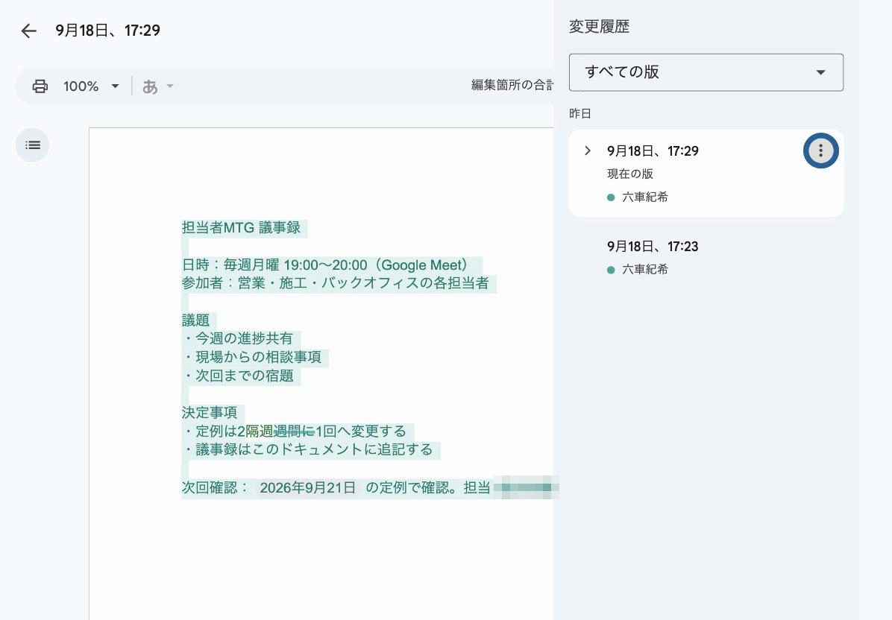

---

<!-- header: '予備 2. Googleカレンダー' -->
# 社外の人との日程調整は「予約ページ」で相手に選んでもらう

<b>作成→予約スケジュール</b>受け付ける曜日・時間帯・1枠の長さを決める

<b>リンクを送る</b>相手は空いている枠を選ぶだけ。 Meet付きの予定が自動で入る

<b>「時間を探す」との使い分け</b>社内は時間を探す、社外・お客様は予約ページ

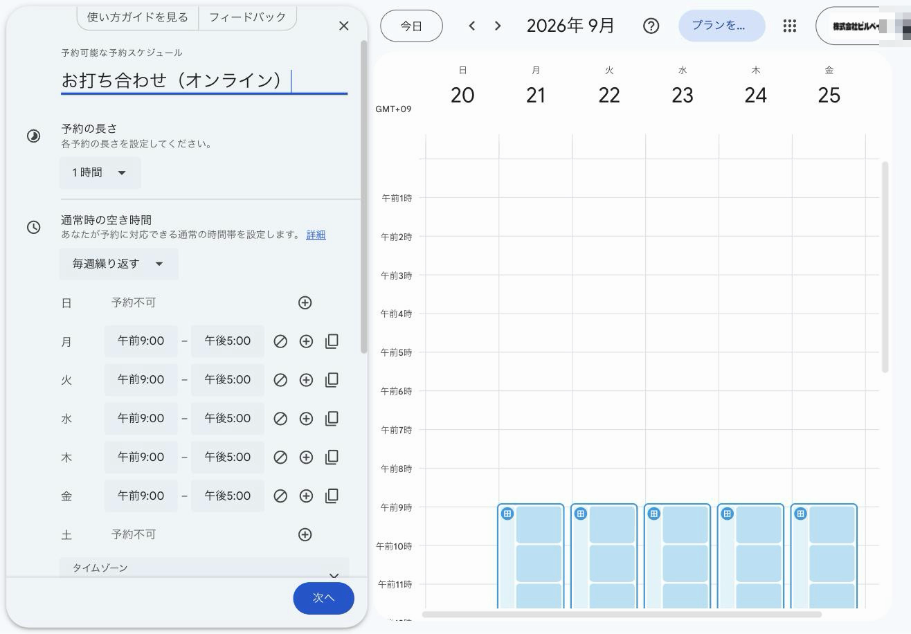

---

<!-- header: '予備 3. Google Meet' -->
# 同じ部屋から入るときは「コンパニオンモード」

参加前

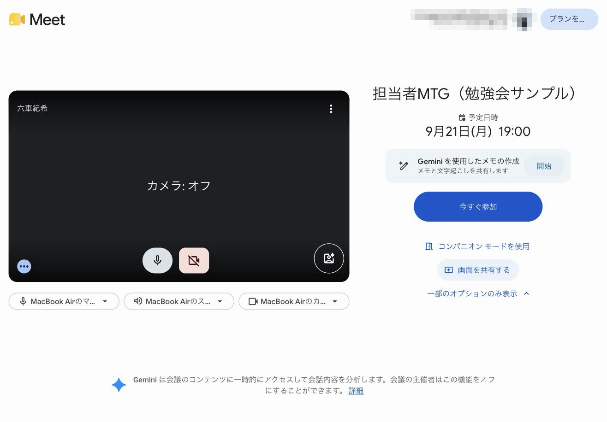

「その他の参加方法」→「コンパニオンモードを使用」

参加後

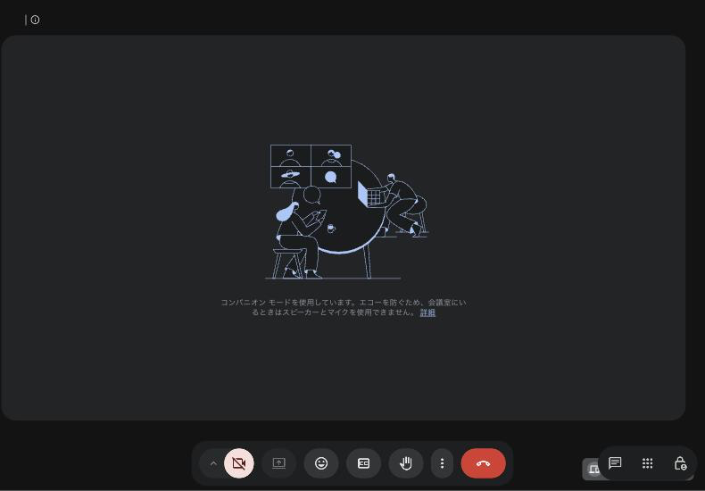

マイクとスピーカーが最初から切れる。 画面共有・チャット・挙手はできる

